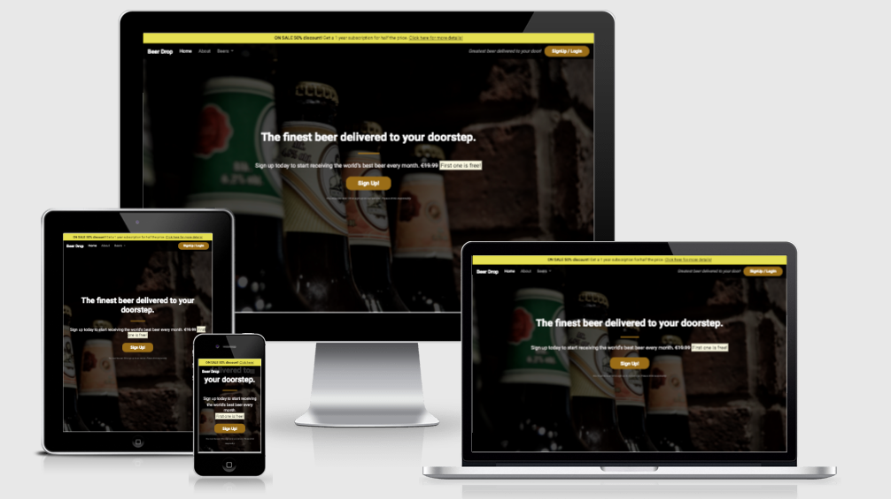

# [Beer Drop](https://anamelisago.github.io/beer-drop-bs/)
***
 
## Table of Contents:
* [What does it do and what does it need to fulfill?](#what-does-it-do-and-what-does-it-need-to-fulfill)
* [Functionality of Project](#functionality-of-project)
* [User Experience](#user-experience)
   * [User Stories](#user-stories)
   * [Design](#design)
       * [1. Font](#1-font)
       * [2. Color Scheme](#2-color-scheme)
       * [3. Logo](#3-logo)
       * [4. Geometry](#4-geometry)
       * [5. Wireframing](#5-wireframing)
* [Technology Used](#technology-used)
* [Database](#database)
* [Features](#features)
   * [Future Features](#future-features)
* [Testing](#testing)
   * [Defensive Design](#defensive-design)
* [Deployment](#deployment)
* [Credits](#credits)
   * [Special Thanks & Acknowledgements](#special-thanks--acknowledgements)
 
***

## Welcome to Beer Drop!
 

 
***
 
## What does it do and what does it need to fulfill?

Beer Drop is a site that delievers beer with just one click. It also offers monthly subscription to deliever different types of beer. Everyone can taste different beers from around the world every month. 

This is the favicon used for the webpage. B-shaped drop for Beer Drop.

### Functionality of Project
This webpage contains a list of different type of beer that can be purchased with lower price than the martket price elsewhere. The sign up form is to create a monthly subscription to taste different type of beer delievered automatically to the user's door.
 
[Back to top](#table-of-contents)
 
## User Experience:
 
#### User Stories:
_Generic (Guest/Public) User:_
* As a Generic User, I want to browse the different types of beers, so that I can see their products.

* As a Generic User, I want to have some good offer before I try thier service.

* As a Generic User, I want to 

* As a Generic User, I want to

 
_Registers (Logged in) User:_
* As a Registered User, I want to have some new offers so that I can still use their services.

* As a Registered User, I want to...
 
_Developer:_
* As a Developer, I want to create a new webpage in the easier way.
 
* As a Developer, I want to learn new stuff in software developement.

* As a Developer, I want to...

#### Design
 
##### 1. Font
The font used in the project is from Googlefonts. I used **Roboto** for the whole webpage.
 
##### 2. Color Scheme

The colors used are black, brown and white to make it more elegant and simple.
 
##### 3. Logo
The logo used is the name itself to give the site of simplicity but still elegant look.
 

 
##### 4. Geometry
 
The applications geometrical aspects...
 
##### 5. Wireframing
 
The wireframes were created for each individual page on three different screen sizes. Below are the different wireframes.
 

Wireframes

 

 
[Back to Top](#table-of-contents)
 
## Technology Used
 
#### Languages, Frameworks, Editors & Version Control:
 
* Tech stack

   * HTML
   * CSS
   * JavaScript
   * Bootstarp
 
## Features
 
The project boasts several key features:

* Type of Beers

* Sign up Form

* Reviews

* Features
   * Send a gift
   * Payment
   * Contact Us
 
[Back to Top](#table-of-contents)
 
#### Future Features:
 
* For the future, the company wants to be able to organize events for beer tasting.

## Testing
 
Testing was done throughout the developement of the webpage. Developer tools is used for testing each code and test the responsiveness of the code before pushing it to Github. 
 
#### Found Bugs and Fixes:
 
During manual testing...
 
[Back to Top](#table-of-contents)
 

 
## Deployment
 
Below are the details of the deployment process using Github:
1. From the main menu bar of the repository, click `Settings`.
2. Scroll down and select `Page`from the left hand side menu.
3. From the `Sources` section of Github Pages, change `none` into `main`.
4. Click Save button just beside the dropdown menu.
5. A message prompts just above that section stating that the page is ready to be published and a deployed repository link is provided after the message.
6. Wait for a few seconds and refresh the page.
7. When a green check appears before the link, it is ready to be visualized in any browser.
 
[Back to Top](#table-of-contents)
 
## Credits
 
* Code Institute for providing us examples to make this website.
 
[Back to Top](#table-of-contents)
 
#### Special Thanks & Acknowledgements:
 
* Team 11 🤜
 
###### <i>Disclaimer: This project was created for educational use only as part of Code Institute's exercises in Bootstrap Lessons</i>
 
[Back to Top](#table-of-contents)
